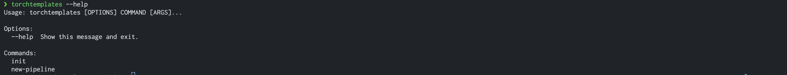
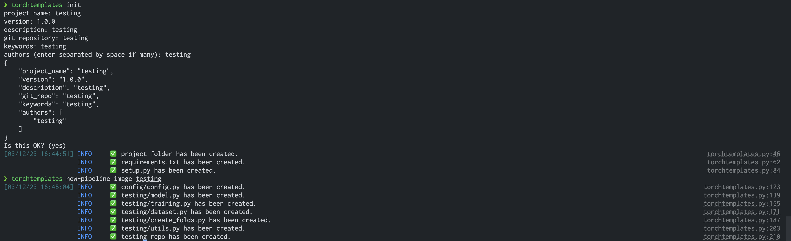
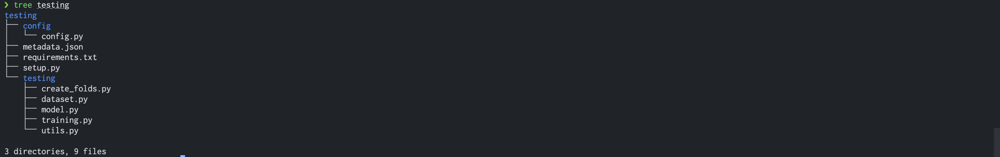

# torchtemplates

[](https://pepy.tech/project/torchtemplates)

- The file structure is vastly inspired from [madewithml.com](https://madewithml.com/) and many Kaggle Kernels from top kagglers.

- Till now, this would create a package for you with the `setup.py` and the `requirements.txt`.
- TODO:
    - Add TODO for hyperparameter tuning.
    
## Installation
https://pypi.org/project/torchtemplates/
```bash
pip install torchtemplates
```

## File structure
```
- src
    - config
        - config.py
    - project_name
        - main.py
        - dataset.py
        - model.py
        - train.py
        - utils.py
        - hyparam.py (need to add...)
    - README.md
    - requirements.txt
```

## How to use?

### What are the functionalities?


### Commands


### Final Tree

